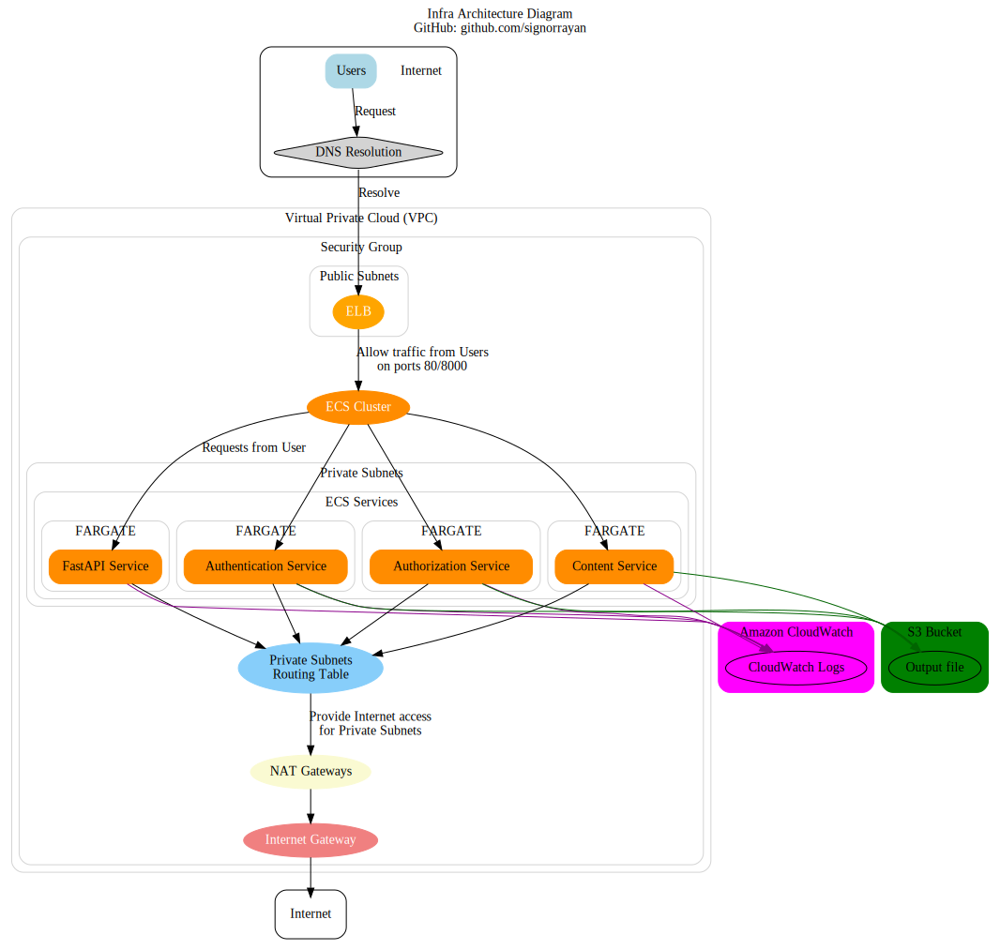

# Infrastructure as Code (IaC) with Terraform for Microservices Deployment on AWS

This Terraform script automates the setup of AWS infrastructure for deploying microservices using Amazon Elastic Container Service (ECS). The deployment includes critical AWS resources like Amazon VPC, subnets, NAT gateways, ECR repositories, ECS clusters, an Application Load Balancer (ALB), and CloudWatch logs.



## Prerequisites

Before running this Terraform script, make sure you have the following:

- [Terraform](https://www.terraform.io/downloads.html) installed.
- AWS credentials configured on your machine.
- Docker installed if you plan to build custom Docker images for your microservices.

## Usage

1. **Clone this repository:**

    ```bash
    git clone https://github.com/signorrayan/aws-terraform-microservices
    cd aws-terraform-microservices
    ```

2. **Initialize Terraform:**

    ```bash
    terraform init
    ```

3. **Review and modify the `variables.tf` file according to your requirements.**


4. Review the configuration and verify that the resources that Terraform is going to create or update match your expectations:
   ```bash
   terraform plan
   ```
   
5. **Apply the Terraform configuration:**

    ```bash
    terraform apply
    ```

6. **Confirm the changes by typing "yes" when prompted.**


## Additional Information


1. ### Automated Versioning and Releases with Semantic Release

In this project, I utilize [Semantic Release](https://github.com/semantic-release/semantic-release) for automating the versioning and release process. Semantic Release follows the principles of semantic versioning and automates the process of assigning version numbers and creating release notes.

Semantic Release offers several benefits:

- **Consistency:** By following the semantic versioning specification, Semantic Release ensures a consistent versioning scheme that's easy to understand and communicate.

- **Automation:** Semantic Release automates the entire release process, including determining the next version number, generating release notes, and publishing the release. This reduces the manual effort and potential for human error.

- **Time Efficiency:** With the release process automated, developers can focus more on coding and less on administrative tasks.

- **Clear Communication:** By generating detailed release notes for each release, Semantic Release provides clear communication to users about what changes each new version brings.

To use Semantic Release, a strict commit message convention must be followed. This project uses the [Angular Commit Message Conventions](https://github.com/angular/angular.js/blob/master/DEVELOPERS.md#-git-commit-guidelines). This convention includes the type of change, the scope of the change, a short description, and optionally a longer description and any breaking changes.

By integrating Semantic Release into our project, we aim to improve the efficiency of our release process, provide clear and consistent communication to our users, and maintain a high standard of quality.


2. ### Docker Images and CI/CD

While it's a common and best practice to create and push Docker images for Python programs in a CI/CD pipeline, in this project, the process is demonstrated within the Terraform code. This approach was chosen to provide a clear, end-to-end example of setting up and operating the infrastructure.

3. ### Terraform State Management

To ensure the Terraform state is stored in a secure and accessible location, it's recommended to use a remote backend like S3 or Terraform Cloud. This approach helps avoid conflicts when multiple team members are working on the infrastructure. However, in this project, to keep the focus on the main task, this has not been implemented but can be added as an improvement.

4. ### Potential Improvements

There are several areas where this project could be further improved:

- **Security:** Currently, the Application Load Balancer (ALB) accepts traffic on port 80. For enhanced security, traffic could be redirected from port 80 to 443 to ensure all communication is encrypted using SSL/TLS.

- **Terraform Code Organization:** The Terraform code in this project is primarily contained within a single `main.tf` file. For better maintainability and reusability, the code could be refactored into separate modules, such as a VPC module, ECS module, etc.

5. ### Fargate vs EC2

In this project, AWS Fargate is used for running the ECS services instead of EC2 instances. This decision was made to allow for cost optimization based on traffic and to eliminate the need for infrastructure management, which is a requirement when using EC2. Additionally, Fargate manages **autoscaling** , removing the need for manual configuration and management.


## Terraform Modules and Resources

1. ### VPC and Subnets

- Creates a Virtual Private Cloud (VPC) with public and private subnets.
- Configures route tables, internet gateway, and NAT gateways for private subnet internet access. IT allows them to access the internet without exposing them to inbound internet traffic.


2. ###  ECR Repositories

- ECR repositories are created for each microservice. These repositories will store the Docker images for the microservices. (FastAPI, Authentication, Authorization, and Content).

3. ### Docker Images

- Builds Docker images for each microservice using specified Dockerfiles and context paths and pushed to the respective ECR repositories.

4. ###  ECS Cluster and ALB

- Sets up an ECS cluster for running microservices in a Fargate launch type.
- Creates an Application Load Balancer (ALB) to route traffic to microservices.

5. ### ECS Task Definitions and Services

- Defines ECS task definitions for each microservice with Fargate compatibility.
- Configures ECS services for each microservice, ensuring desired task count and network configuration.

6. ###  IAM Roles and Policies

- Creates IAM roles for ECS execution and S3 access.
- Defines policies for ECS execution and S3 access.

7. ###  S3 Bucket

- An S3 bucket is created that can be used in Python scripts to store their output there.

8. ###  AWS Internet Gateway and NAT Gateways

- An Internet Gateway is created and attached to the VPC to allow the public subnets to access the internet. NAT Gateways are created in the public subnets to allow the private subnets to access the internet.

9. ###  AWS Route Tables and Network ACLs

- Route tables are created for the subnets to control their traffic flow. Network ACLs are also created to provide a rule-based firewall for controlling traffic at the subnet level.

10. ###  AWS Security Group

- A security group is created for the Application Load Balancer (ALB) and ECS Services to control inbound and outbound traffic.


## Outputs

- Outputs include important information like the ALB DNS name, ECR repository URLs, and ECS service details.

## Cleanup

To destroy the created infrastructure, first you should clean the S3 bucket (which contains microservices output files), then run:

```bash
terraform destroy
